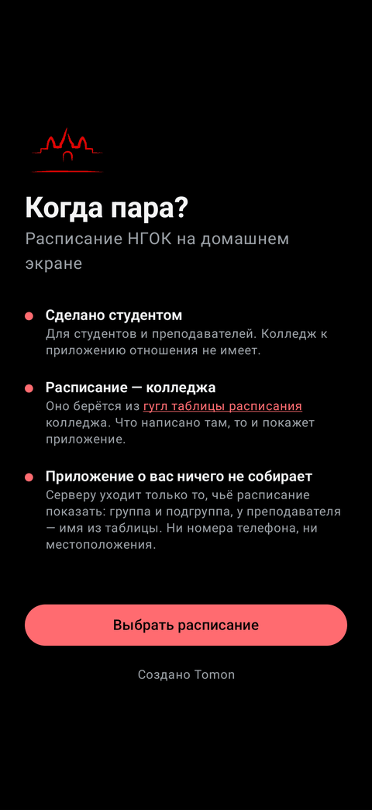
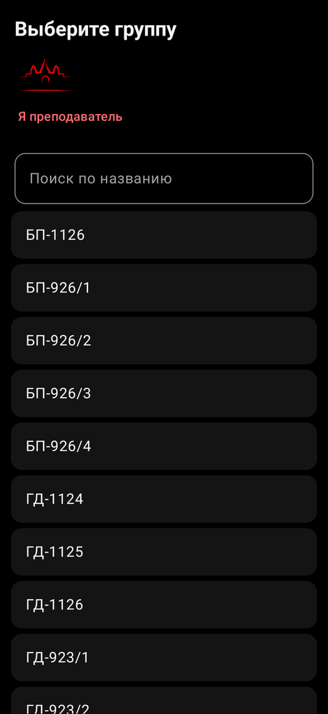

# Когда пара?

**Расписание НГОК на домашнем экране Android.** Виджеты и приложение для
студентов и преподавателей Новосибирского городского открытого колледжа.


[](https://github.com/tomon-one/kogda-para/actions/workflows/tests.yml)

**[Скачать](https://schedule.edelweiss-alpine-confederation.ru/download/latest.apk)**
· [все версии](https://github.com/tomon-one/kogda-para/releases)
· [как поставить](docs/install.md) · вопросы — [@toomonn](https://t.me/toomonn)

> **Пре-релиз.** Всё, что приложение должно уметь, уже есть, дальше — только
> исправления и небольшие улучшения. Живьём оно проверено на телефоне автора с
> Android 12; другие телефоны пока не проверялись.
>
> **Код писал ИИ** — Claude, по задачам автора и с его правками.
>
> **Не заработало или показывает не то — [напишите](https://t.me/toomonn)** или
> заведите [issue](https://github.com/tomon-one/kogda-para/issues): это полезнее
> всего.

## Как выглядит

<p>
  
  
  
</p>

Виджеты: неделя, день и ближайшая пара.

<p>
  
  
  
</p>
<p>
  
  
</p>

Приложение: первый запуск, расписание в тёмной и светлой теме, выбор группы,
настройки.

## Что умеет

- Три виджета: пары на день, неделя вперёд и ближайшая пара.
- Уведомления об отменах и заменах на сегодня и завтра.
- Напоминание перед парой — включается в настройках.
- Соседняя подгруппа: её пары показываются вместе с вашими.
- Расписание преподавателя — по его имени.
- Без интернета показывает последнее скачанное.
- Блокировки Google в России не мешают: телефон берёт расписание только с
  сервера приложения, а если серверу не отвечает Google, тот забирает таблицу
  через запасную машину за границей.
- Сообщает о новых версиях, обновление ставится из настроек.

## Установка

1. Скачайте файл и откройте его.
2. Разрешите установку тому, чем открыли файл: браузеру, Telegram или «Файлам».
3. На предупреждение Play Защиты нажмите «Всё равно установить».
4. Выберите группу или «Я преподаватель» и добавьте виджет на домашний экран.

Подробнее и что делать, если не получилось, — [docs/install.md](docs/install.md).

Play Защита предупреждает, потому что приложения нет в Google Play. Все версии
подписаны одним ключом, так что поддельное обновление поверх установленного
приложения не встанет.

## Чего не умеет

- Работает только с расписанием НГОК.
- Версии для iPhone нет: Apple не даёт раздавать приложения без магазина и
  платной программы разработчика.
- Знает ровно то, что опубликовано в таблице колледжа. Днём её правка доходит
  до телефона за двадцать минут, если открыть приложение, и до полутора часов,
  если нет.
- На Xiaomi, Huawei и Samsung система может не будить приложение в фоне: тогда
  виджет обновится, когда откроете приложение. Как это исправить —
  [docs/install.md](docs/install.md#если-не-получилось).

## Что уходит на сервер

Только то, чьё расписание открыто, и за какие дни. Учётной записи, аналитики и
рекламы нет, всё остальное остаётся на телефоне.

## Как устроено

Служба на сервере сама читает таблицу колледжа и отдаёт телефону только нужное,
приложение это показывает.

- `server/` — служба на Python (FastAPI).
- `android/` — приложение и виджеты на Kotlin.
- `docs/` — [формат таблицы](docs/source-format.md),
  [ответы сервера](docs/api.md), [версии](docs/versions.md),
  [установка](docs/install.md).
- `tools/` — вспомогательные скрипты.

```bash
# Сервер: Python 3.12+, для чтения таблицы нужен ключ Google Sheets API
# (WHENSCLASS_SHEETS_API_KEY в server/.env)
cd server && python3 -m venv .venv
.venv/bin/python -m pip install -c constraints.txt -e ".[dev]"
.venv/bin/python -m uvicorn whensclass.main:app --port 8081 --app-dir src

# Приложение: JDK 21
cd android && ./gradlew assembleDebug
```

## Лицензия

Код — под [AGPL-3.0](LICENSE). Логотип колледжа в `assets/` принадлежит
колледжу и под лицензию не входит.
