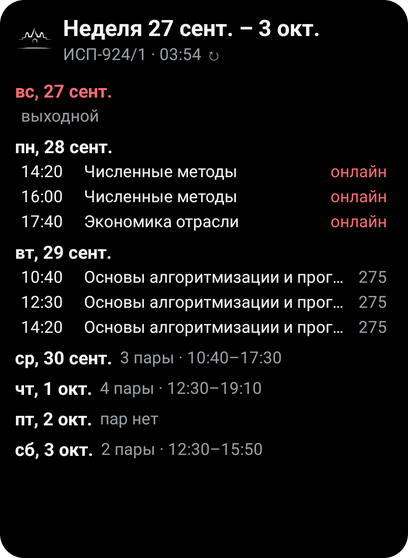
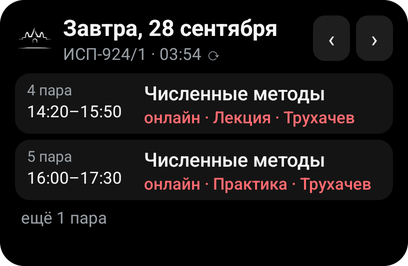
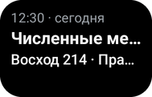
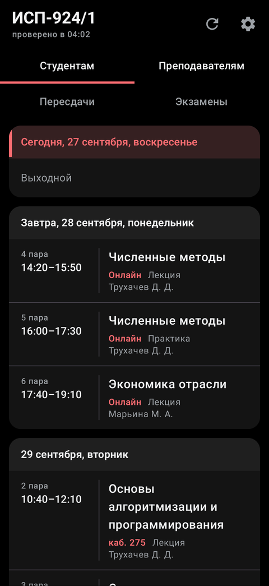
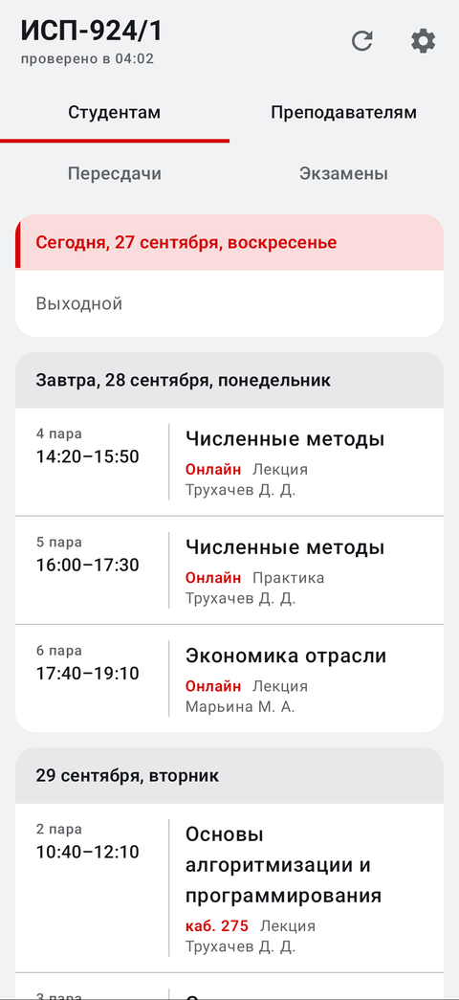
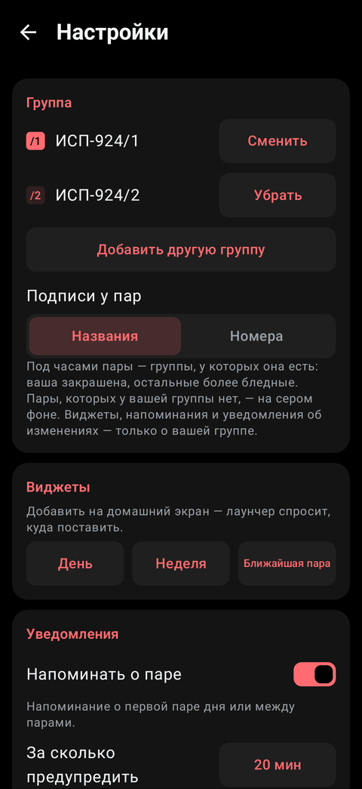
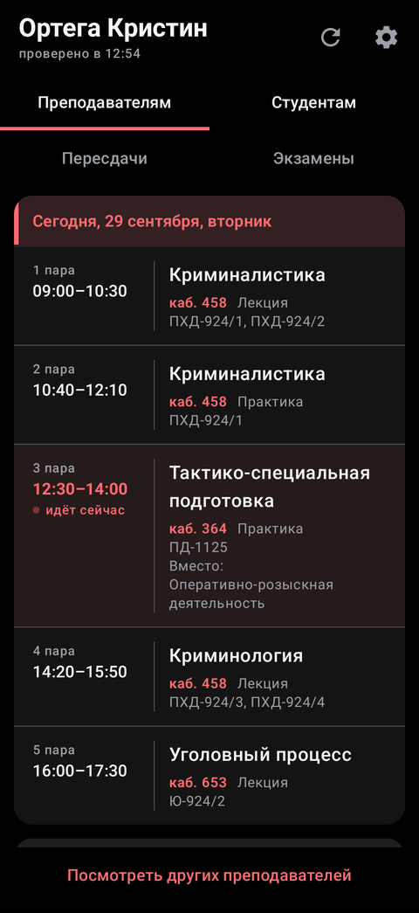
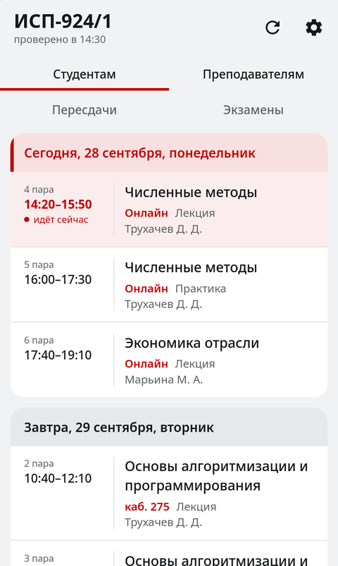
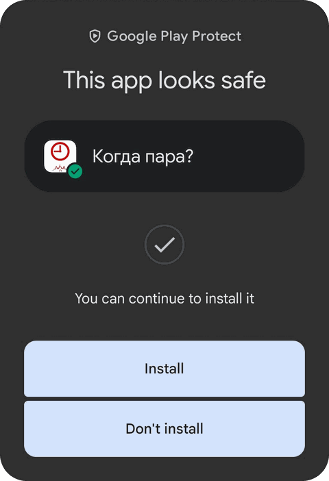
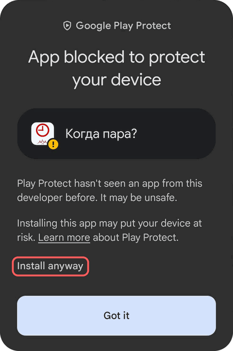

# Когда пара?

**Расписание НГОК на домашнем экране Android и в браузере.** Виджеты и
приложение для студентов и преподавателей Новосибирского городского открытого
колледжа, а для айфонов и тех, кто не хочет ставить файл, — [сайт](https://kogda-para-nsk.ru).
Можно и дальше искать свою колонку в таблице колледжа, а можно поставить
приложение: пары те же.


[](https://github.com/tomon-one/kogda-para/actions/workflows/tests.yml)

**[Скачать](https://kogda-para-nsk.ru/download/latest.apk)**
· [сайт](https://kogda-para-nsk.ru) · [все версии](https://github.com/tomon-one/kogda-para/releases)
· [как поставить](docs/install.md) · вопросы — [@toomonn](https://t.me/toomonn)

> **Версия 1.0.0.** Проверено на телефоне автора с Android 12, на других пока
> нет.
>
> **Код писал ИИ** — Claude, по задачам автора и с его правками.
>
> **Не заработало или показывает не то? Значит, проблема в нас, [напишите](https://t.me/toomonn)**
> или заведите [issue](https://github.com/tomon-one/kogda-para/issues).

## Как выглядит

<p>
  
  
  
</p>

<p>
  
  
  
</p>

## Что умеет

- Три виджета: пары на день, неделя вперёд и ближайшая пара.
- Расписание обновляется само, без интернета не пропадает: видно последнее скачанное.
- Уведомления об отменах и заменах на сегодня и завтра.
- Напоминание перед парой — включается в настройках.
- Другие группы и подгруппы, до шести вместе со своей: их пары на экране
  рядом с вашими, под временем — названия или номера групп, у которых эта пара.
- Расписание преподавателя — по его имени.
- Блокировка Google в России телефону не помешает: за расписанием он ходит
  только на сервер приложения.
- Сообщает о новой версии, ставится она кнопкой в настройках.

## Преподавателям

В списке групп первой строкой — «Я преподаватель», дальше выберите себя.
Отдельного листа у преподавателя в таблице колледжа нет: сервер собирает его
расписание из колонок групп, поэтому у каждой пары написано, у каких групп она.

Виджеты, напоминания перед парой и уведомления об изменениях работают так же,
как у студента. Других групп рядом со своими парами у преподавателя нет.
Расписание коллег — во вкладке «Преподавателям», нужных можно закрепить
звёздочкой. На сайте выбор тот же.



## Сайт

[kogda-para-nsk.ru](https://kogda-para-nsk.ru) — то же расписание в браузере:
группы, преподаватели, другие группы рядом со своей, ссылки на занятия. Без интернета открывается
с последним скачанным. Виджетов у сайта нет. Уведомления об отменах и заменах
и напоминания о паре — beta: могут не дойти; на айфоне — со значком на «Домой»
(iOS 16.4 и новее); включаются в настройках сайта.

На айфоне — в Safari кнопка «Поделиться» (на панели или в меню «•••» у адреса)
→ «На экран „Домой“»: сайт будет открываться значком, как приложение. У значка
свои настройки — группу в нём нужно выбрать ещё раз. На Android — меню браузера
→ «Добавить на главный экран».



## Установка

1. Скачайте файл и откройте его.
2. Разрешите установку тому, чем открыли файл: браузеру, Telegram или «Файлам».
   На новых Samsung ещё выключите на время установки «Автоблокировку»:
   «Настройки» → «Безопасность и конфиденциальность» → «Автоблокировка».
3. Play Защита покажет одно из окон, они ниже.
4. Выберите группу или «Я преподаватель» и добавьте виджет на домашний экран —
   из списка виджетов или кнопкой в «Настройки» → «Виджеты».
5. На Xiaomi, Huawei, Honor, Samsung, Tecno, Infinix, OPPO, realme, OnePlus и
   vivo откройте «Настройки» → «Работа в фоне» и пройдите пункты по очереди:
   без этого виджет и напоминания ждут, пока приложение откроют.

**Первое окно:** Google проверил файл и ничего опасного не нашёл. Нажмите
«Install» («Установить»).



**Второе окно:** Google не знает разработчика. Нажмите мелкую надпись
«Install anyway» («Всё равно установить»), большая кнопка «Got it» отменяет
установку.



**Третье окно:** «App scan recommended» — Google этот файл ещё не видел.
«Scan app» отправит его на проверку, или «More details» → «Install without
scanning»: телефон спросит PIN или отпечаток.

Бояться не надо: предупреждает она потому, что приложения нет в Google Play. Все версии
подписаны одним ключом, и поддельное обновление поверх не встанет; отпечаток
ключа — в [SECURITY.md](SECURITY.md#подпись). Что делать, если не
получилось, — в [docs/install.md](docs/install.md).

## Чего не умеет

- Работает только с расписанием НГОК.
- Приложения для iPhone нет, только сайт: Apple не даёт ставить приложения без
  App Store.
- Знает ровно то, что опубликовано в таблице колледжа. Днём её правка доходит
  до телефона за двадцать минут, если открыть приложение, и до полутора часов,
  если нет.

## Что уходит на сервер

Только то, чьё расписание открыто, за какие дни и номер сборки приложения
(чтобы сказать «обновите», когда старая перестанет понимать сервер). Кто открыл,
серверу всё равно: учётной записи, аналитики и рекламы нет, остальное остаётся
на телефоне или в браузере. У приложения копии нигде нет: удалите его, и всё уйдёт вместе с ним.
Если сервер не отвечает или не отдаёт файл, за новой версией приложение идёт на
GitHub — группа и настройки туда не уходят, а GitHub видит адрес телефона.

Если на сайте включены уведомления, сервер хранит, пока они включены, адрес и
ключи, по которым браузер их принимает, группу или имя преподавателя, что
присылать, какой сайт, когда его открывали последний раз и когда до браузера
впервые дошло уведомление, а если группы или имени не станет в таблице — когда
об этом сообщили. Выключите — запись сотрётся. Доставляет уведомления служба
браузера — Apple, Google, Mozilla или Microsoft: она видит, когда уведомление
пришло, но не его текст.

## Как устроено

Служба на сервере сама читает таблицу колледжа и отдаёт только нужное: в
таблицу смотреть не надо, видны сразу пары.

- `server/` — служба на Python (FastAPI), пакет `src/whensclass/`:
  - `sources/` — чтение таблицы из Google Sheets и поиск нужного листа;
  - `parser/` — разбор листа: колонки групп, ячейки пар, даты, сдвиги блоков;
  - `service/` — обновление по расписанию, проверка нового снимка, тревоги;
  - `api/` — ответы `/v1/…`, `push/` — уведомления сайта;
  - `domain/`, `storage/` — модели, идентификаторы, снимки на диске.
- `android/` — приложение и виджеты на Kotlin, пакет `ru.whensclass`:
  - `ui/` — экраны, `widget/` — виджеты (Glance);
  - `data/` — запросы к серверу, хранение, сравнение расписаний, обновление;
  - `notify/` и `work/` — напоминания, уведомления и фоновая работа.
- `web/` — сайт: HTML, CSS и JS-модули без сборки и библиотек; экраны — в
  `assets/js/ui/`, запуск и переходы — `main.js` и `route.js`, данные — `repo.js`.
- `docs/` — [формат таблицы](docs/source-format.md),
  [ответы сервера](docs/api.md), [версии](docs/versions.md),
  [установка](docs/install.md).
- `tools/` — вспомогательные скрипты.

Комментарии в коде объясняют, почему он такой; история решений в них не пишется
(за этим следит `server/tests/test_public_text.py`).

Сервер — Python 3.12 или новее; для чтения таблицы нужен ключ Google Sheets API
(`WHENSCLASS_SHEETS_API_KEY` в `server/.env`):

```bash
cd server
python3 -m venv .venv
.venv/bin/python -m pip install -c constraints.txt -e ".[dev]"
.venv/bin/python -m uvicorn whensclass.main:app --port 8081 --app-dir src
```

Приложение — JDK 21 и Android SDK с platform 37, из корня репозитория:

```bash
cd android
./gradlew assembleDebug
```

Сайт — Node.js 22 для тестов; на своей машине он открывается с ответами
боевого сервера на http://127.0.0.1:8090:

```bash
node --test 'web/tests/*.test.mjs'
python3 tools/web_dev.py
```

## Лицензия

Код — под [AGPL-3.0](LICENSE). Логотип колледжа — `assets/logo-ngok.svg` и
сделанные из него иконки и значки приложения в `android/app/src/main/res` и
сайта в `web/assets` — принадлежит колледжу и под лицензию не входит, как и данные таблицы колледжа в
тестовых фикстурах.
